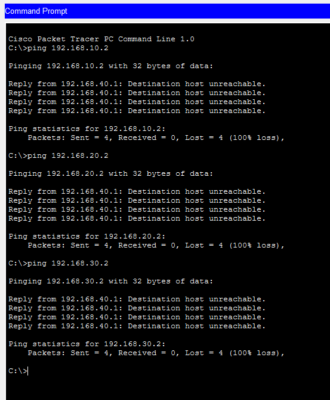
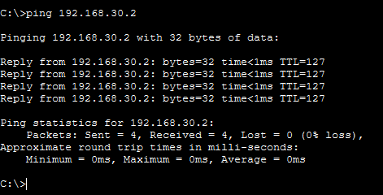

# Enterprise Secure Network Monitoring System

## Project Overview

This project demonstrates the design and implementation of a secure enterprise network infrastructure using Cisco Packet Tracer.

The network is segmented into multiple departments using VLANs and interconnected through Router-on-a-Stick inter-VLAN routing. Security controls such as DHCP and Extended Access Control Lists (ACLs) have been implemented to protect internal resources and simulate real-world enterprise security practices.

---

# Network Architecture

| Department | VLAN    | Network Address | Gateway      |
| ---------- | ------- | --------------- | ------------ |
| HR         | VLAN 10 | 192.168.10.0/24 | 192.168.10.1 |
| IT         | VLAN 20 | 192.168.20.0/24 | 192.168.20.1 |
| Finance    | VLAN 30 | 192.168.30.0/24 | 192.168.30.1 |
| Guest      | VLAN 40 | 192.168.40.0/24 | 192.168.40.1 |

---

# Phase 1 - Enterprise Network Design

## Features Implemented

* VLAN Segmentation
* Router-on-a-Stick Inter-VLAN Routing
* Wireless Guest Network
* File Server Integration
* Network Printer Integration
* Department-Based Network Segmentation
* Connectivity Validation

---

## Network Topology

---

## VLAN Verification

Verified proper VLAN creation and port assignments.

---

## Connectivity Validation

Validated successful communication between authorized departments and resources.

---

# Phase 2 - DHCP and Security Implementation

## DHCP Configuration

Configured the Cisco Router as a DHCP Server to automate IP address allocation across all VLANs.

### DHCP Pools Created

* HR VLAN (10)
* IT VLAN (20)
* Finance VLAN (30)
* Guest VLAN (40)

### Benefits

* Automatic IP Address Assignment
* Centralized Network Management
* Reduced Administrative Overhead
* Improved Scalability

---

## Access Control Lists (ACLs)

Implemented Extended ACLs to isolate the Guest Network from internal enterprise resources.

### Security Policies

| Source               | Destination        | Action |
| -------------------- | ------------------ | ------ |
| Guest VLAN           | HR VLAN            | Deny   |
| Guest VLAN           | IT VLAN            | Deny   |
| Guest VLAN           | Finance VLAN       | Deny   |
| Guest VLAN           | File Server        | Deny   |
| Internal Departments | Internal Resources | Allow  |

---

## ACL Configuration

---

## Security Validation

Verified that Guest VLAN devices cannot access internal enterprise resources.

---

# Phase 3 - Security Monitoring and Attack Simulation

## Objective

Validate the effectiveness of implemented security controls through simulated unauthorized access attempts.

---

## Attack Simulation

Simulated multiple unauthorized access attempts from the Guest VLAN to protected enterprise resources.

### Attack Simulation Evidence

---

## Security Monitoring Results

The Guest VLAN attempted to access:

* HR Department
* IT Department
* Finance Department
* File Server

All access attempts were successfully blocked by Extended ACL policies.

---

## Authorized Access Verification

Verified that legitimate internal communication remained operational after ACL implementation.

---

## Security Validation Summary

| Source             | Destination        | Result  |
| ------------------ | ------------------ | ------- |
| Guest VLAN         | HR VLAN            | Blocked |
| Guest VLAN         | IT VLAN            | Blocked |
| Guest VLAN         | Finance VLAN       | Blocked |
| Guest VLAN         | File Server        | Blocked |
| IT Department      | Internal Resources | Allowed |
| HR Department      | Internal Resources | Allowed |
| Finance Department | Internal Resources | Allowed |

---

## Conclusion

The implemented security controls successfully protected enterprise resources from unauthorized guest access while maintaining normal business communication between internal departments.

The project demonstrates practical implementation of network segmentation, access control, and security validation techniques commonly used in enterprise environments.

---

# Technologies Used

* Cisco Packet Tracer
* VLAN Configuration
* Router-on-a-Stick
* Inter-VLAN Routing
* DHCP
* Extended ACLs
* Wireless Networking
* Network Security
* Routing and Switching

---

# Skills Demonstrated

### Networking

* VLAN Segmentation
* Switching
* Trunking
* Inter-VLAN Routing
* DHCP Configuration
* IP Addressing

### Cybersecurity

* Access Control Lists (ACLs)
* Network Isolation
* Security Validation
* Attack Simulation
* Security Monitoring

### Professional Skills

* Network Troubleshooting
* Technical Documentation
* Security Analysis
* Infrastructure Design

---

# Repository Contents

* Enterprise-Network-Design.pkt
* TOPOLOGY.png
* VLAN-VERIFICATION.png
* CONNECTIVITY-VALIDATION.png
* ACL-CONFIGURATION.png
* SECURITY-VALIDATION.png
* ATTACK-SIMULATION.png
* AUTHORIZED-ACCESS.png

---

# Future Enhancements

## Phase 4 - Enterprise Expansion

Planned Improvements:

* Multi-Branch Enterprise Network
* OSPF Dynamic Routing
* WAN Connectivity
* Branch Office Integration
* Advanced Monitoring Solutions

---

## Author

Madhu Hariharan

Enterprise Networking & Cybersecurity Project

