# Enterprise Secure Multi-Branch Network Monitoring System

## Overview

This project simulates a real-world Enterprise Secure Multi-Branch Network using Cisco Packet Tracer. The network consists of a Headquarters (HQ) and a Remote Branch Office connected through a WAN link using OSPF dynamic routing.

The implementation includes VLAN segmentation, Inter-VLAN routing, DHCP services, Extended ACL security, Guest Network Isolation, File Server integration, Network Printer access, and OSPF-based branch connectivity.

---

## Features

- VLAN Segmentation
- Inter-VLAN Routing (Router-on-a-Stick)
- DHCP Configuration
- Extended ACL Security
- Guest Network Isolation
- OSPF Dynamic Routing
- Multi-Branch Architecture
- File Server Integration
- Network Printer Integration
- Connectivity Validation

---

# Network Topology

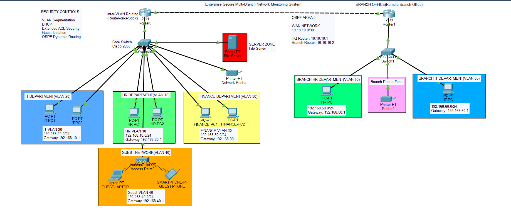

---

# VLAN Segmentation

## Headquarters VLAN Configuration

| VLAN | Department | Network |
|------|------------|----------|
| 10 | HR | 192.168.10.0/24 |
| 20 | IT | 192.168.20.0/24 |
| 30 | Finance | 192.168.30.0/24 |
| 40 | Guest | 192.168.40.0/24 |

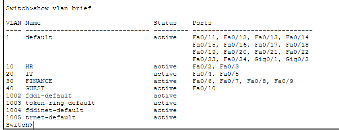

---

## Branch VLAN Configuration

| VLAN | Department | Network |
|------|------------|----------|
| 50 | Branch HR | 192.168.50.0/24 |
| 60 | Branch IT | 192.168.60.0/24 |

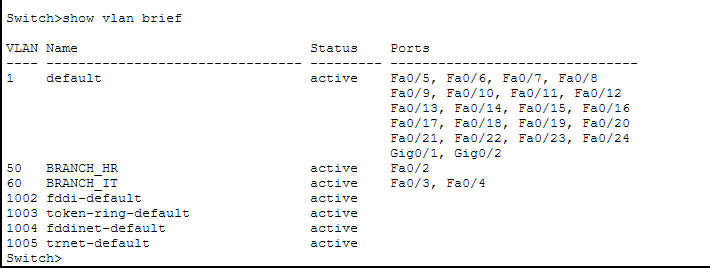

---

# DHCP Validation

Automatic IP assignment verification.

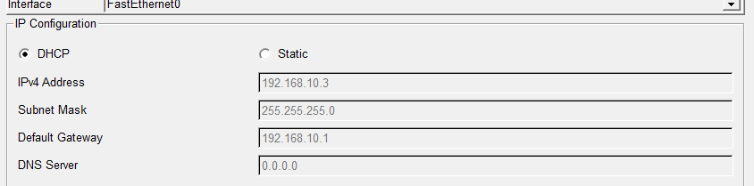

---

# Branch Office Configuration

Branch HR device configuration.

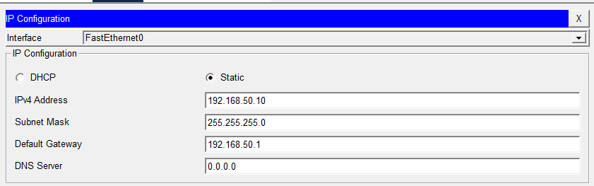

---

# ACL Security Configuration

## HQ Router ACL

Guest users are blocked from accessing internal departments.

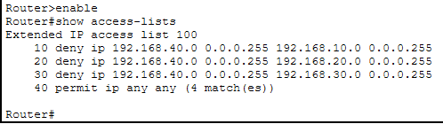

## Branch Router ACL

Branch office access restrictions.

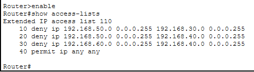

---

# Security Validation

Guest network isolation testing.

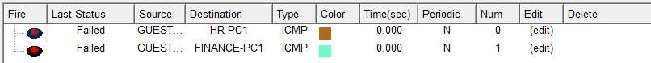

---

# OSPF Dynamic Routing

## OSPF Neighbor Relationship

Successful OSPF adjacency between HQ and Branch routers.

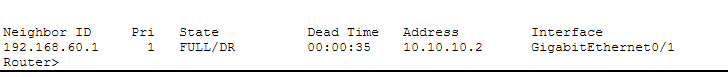

---

## HQ Routing Table

HQ learns Branch networks dynamically.

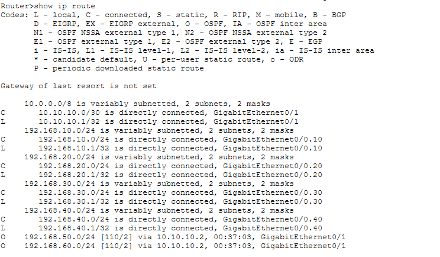

---

## Branch Routing Table

Branch learns HQ networks dynamically.

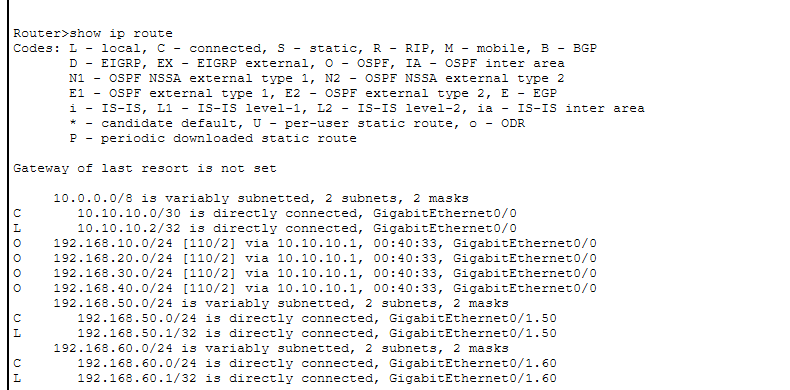

---

# Connectivity Validation

Successful communication across enterprise and branch networks.

---

# Technologies Used

- Cisco Packet Tracer
- VLAN Segmentation
- Router-on-a-Stick
- DHCP
- Extended ACLs
- OSPF Routing
- Network Security
- WAN Connectivity

---

# Skills Demonstrated

- Enterprise Network Design
- Routing & Switching
- VLAN Implementation
- DHCP Deployment
- ACL Configuration
- OSPF Routing
- Network Security
- Troubleshooting
- Documentation

---

# Project File

Packet Tracer Simulation:

**Enterprise-Secure-Network-Design.pkt**

---

# Author

**Madhu Hariharan M**

Enterprise Networking & Cybersecurity Enthusiast
Enterprise Networking & Cybersecurity Project

