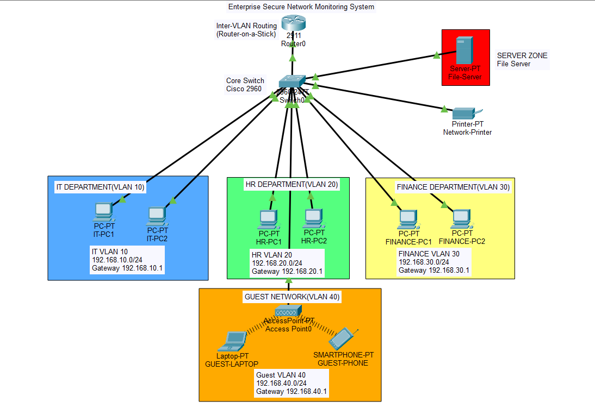
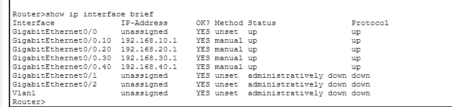
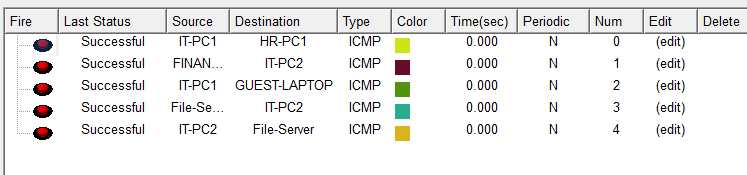
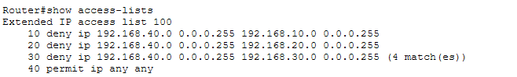
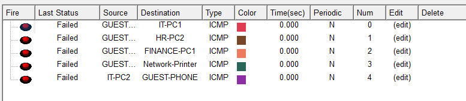

# Enterprise Secure Network Monitoring System

## Project Overview

This project demonstrates the design and implementation of an enterprise network infrastructure using Cisco Packet Tracer.

The network is segmented into multiple departments using VLANs and interconnected through Router-on-a-Stick inter-VLAN routing.

---

## Network Architecture

| Department | VLAN    | Network Address | Gateway      |
| ---------- | ------- | --------------- | ------------ |
| HR         | VLAN 10 | 192.168.10.0/24 | 192.168.10.1 |
| IT         | VLAN 20 | 192.168.20.0/24 | 192.168.20.1 |
| Finance    | VLAN 30 | 192.168.30.0/24 | 192.168.30.1 |
| Guest      | VLAN 40 | 192.168.40.0/24 | 192.168.40.1 |

---

## Phase 1 - Enterprise Network Design

### Features Implemented

* VLAN Segmentation
* Inter-VLAN Routing (Router-on-a-Stick)
* Wireless Guest Network
* File Server Integration
* Network Printer Connectivity
* Static IP Addressing
* Connectivity Validation

### Project Screenshots

#### Network Topology

#### VLAN Verification

#### Connectivity Validation

---

## Phase 2 - DHCP and Security Implementation

### DHCP Configuration

Configured the Cisco Router as a DHCP Server and created DHCP pools for:

* HR VLAN (10)
* IT VLAN (20)
* Finance VLAN (30)
* Guest VLAN (40)

End devices automatically receive:

* IP Address
* Subnet Mask
* Default Gateway

### Access Control Lists (ACLs)

Implemented Extended ACLs to isolate the Guest Network from internal enterprise resources.

### Security Policies

| Source               | Destination        | Action |
| -------------------- | ------------------ | ------ |
| Guest VLAN           | HR VLAN            | Deny   |
| Guest VLAN           | IT VLAN            | Deny   |
| Guest VLAN           | Finance VLAN       | Deny   |
| Guest VLAN           | File Server        | Deny   |
| Internal Departments | Internal Resources | Allow  |

### ACL Configuration

### Security Validation

Guest devices were unable to access internal enterprise resources while departmental communication remained operational.

---

## Technologies Used

* Cisco Packet Tracer
* VLAN Configuration
* Router-on-a-Stick
* DHCP
* Extended ACLs
* Routing and Switching
* Network Security

---

## Skills Demonstrated

* Enterprise Network Design
* VLAN Segmentation
* Inter-VLAN Routing
* DHCP Configuration
* Access Control Lists
* Network Security
* Network Troubleshooting
* Technical Documentation

---

## Future Enhancements

### Phase 3

* Security Monitoring
* Attack Simulation
* Security Incident Report
* Traffic Analysis

### Phase 4

* Multi-Branch Enterprise Network
* OSPF Dynamic Routing
* WAN Connectivity
* Enterprise Expansion

